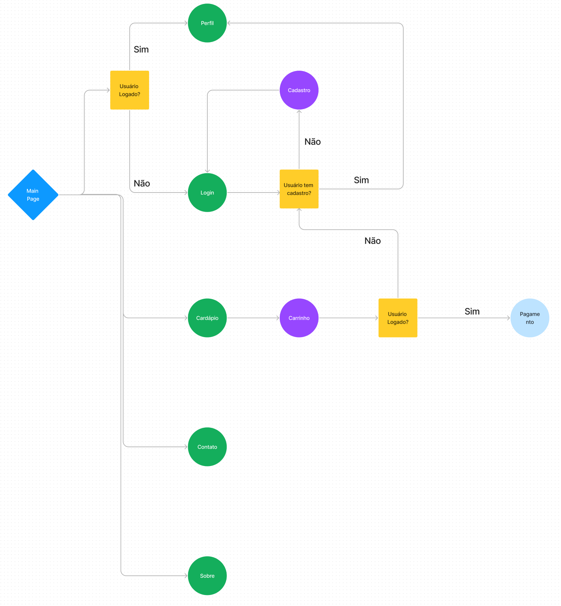
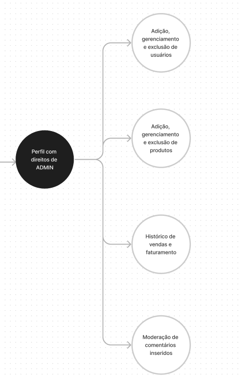

# Projeto Desenvolvimento Web - Pausa Brownies
- Eduardo Barroso Ribeiro Fernandes - 12681733
- Lucas da Silva Claros - 12682592
- Paulo Henrique dos Santos Almeida - 12543926 

## Descrição

Este projeto consiste no desenvolvimento do site de uma loja online especializada na venda de Brownies artesanais, e foi produzido visando aplicar os conceitos práticos da disciplina [SCC0219 - Introdução ao Desenvolvimento Web](https://uspdigital.usp.br/jupiterweb/obterDisciplina?sgldis=SCC0219).

O design do projeto foi desenvolvido utilizando o editor gráfico online [Figma](https://www.figma.com/file/XGRnGMWEZVCLh8bxgKizsG/Pausa-Brownies?type=design&node-id=0-1&t=H95jZJzXORe0ZTdF-0) para prototipagem das telas, e o front-end da aplicação com as linguagens HTML 5 e CSS 3.


## Requisitos
O sistema deve ser capaz de gerenciar dois tipos de usuários: cliente e administrador.

Cliente:
- Identificação: Cada cliente terá um identificador único (ID) associado a ele.
- Informações do perfil: Cada cliente deverá fornecer seu nome, endereço de e-mail e número de telefone.
- Tela de login: Os clientes devem ser capazes de acessar a plataforma através de um processo de autenticação, fornecendo suas credenciais (por exemplo, nome de usuário e senha).
- Gerenciamento do perfil: Os clientes devem poder visualizar e atualizar as informações do seu perfil, incluindo nome, e-mail e telefone.
- Visualização do cardápio: A plataforma deve disponibilizar aos clientes um cardápio, contendo os itens disponíveis para pedido.
- Realização de pedidos: Os clientes devem ser capazes de selecionar os itens desejados no cardápio e realizar pedidos através da plataforma.

Administrador:
- Identificação: Cada administrador também terá um identificador único (ID) atribuído a ele.
- Informações do perfil: Os administradores devem fornecer seu nome, endereço de e-mail, número de telefone e endereço físico.
- Tela de login: Os administradores devem ter acesso a uma tela de autenticação para entrar na plataforma.
- Gerenciamento do perfil: Os administradores devem poder visualizar e atualizar suas informações de perfil, incluindo nome, e-mail, telefone e endereço.
- Gerenciamento do cardápio: Os administradores têm permissão para adicionar, editar e remover itens do cardápio disponível para os clientes.
- Gerenciamento de usuários: Os administradores devem ter a capacidade de gerenciar os usuários cadastrados, incluindo adicionar novos clientes e administradores, bem como editar ou excluir suas informações.


## Diagramas de Navegação
### Sitemap do Cliente

A navegação do cliente considera também usuários externos não autenticados:




[Link do Diagrama no Figma](https://www.figma.com/file/C6LpGyvgDh3yrcQmiUoOSD/PAUSA-BROWNIES?type=whiteboard&node-id=0-1&t=b30D0GP500lRbtIh-0)

### Sitemap do Administrador
Para a navegação do administrador, será a mesma do cliente, com adição dos privilégios de controle:



## Comentários Sobre o Código

## Plano de Testes

## Resultados dos Testes

## Procedimento de Execução

### Milestone 1:

Para acessar os mockups do projeto, acesse o [link](https://www.figma.com/file/XGRnGMWEZVCLh8bxgKizsG/Pausa-Brownies?type=design&node-id=0-1&t=H95jZJzXORe0ZTdF-0) do Figma contendo as telas prototipadas do sistema.


Para acessar as telas funcionais siga os passos abaixo:


1. Clone o repositório com o comando:

```
git clone https://github.com/lucasclaros/web-project-usp
```

2. Na pasta do projeto execute no navegador o arquivo:

```
./web-project-usp/pages/index.html
```
## Comentários